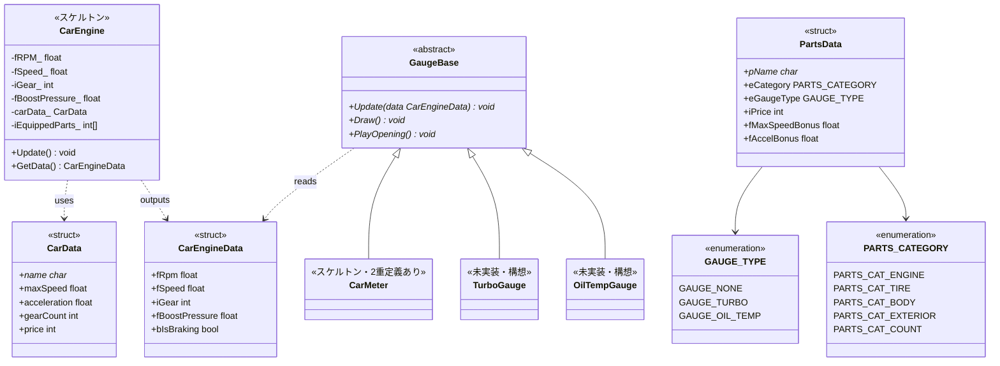

# エンジン・メーター・データ層クラス図(実装リバース)

実装元: `source/car_engine/`、`source/car_meter/`、`source/car_data.h`、`source/parts_data.h`。

実装状況メモ:

- `CarEngine` はスケルトン。`Update()` は中身が空で、引数の入力クラス(構想上の `GameKeyInput`)はコメントアウト中。`GetData()` はメンバをそのまま詰めて返すのみ
- `GaugeBase` は純粋仮想3メソッドの抽象基底として実装済み(処理実体はまだない)
- `CarMeter` は空クラスが2重定義されている: `car_meter.h` の `CarMeter`(GaugeBase を継承していない)と `carMeter.cpp` 内の `CarMeter : public GaugeBase`。統合が必要
- `TurboGauge` / `OilTempGauge` は未実装(構想のみ)
- メーターの針アニメーション等の実挙動は `debug.cpp` のデバッグメーター画面に手続き型でプロトタイプ実装されている(クラス化は未着手)

マスターデータ(グローバル定数):

- `CAR_TABLE[]` / `CAR_TABLE_COUNT` — 車両マスタ(`car_data.cpp`)
- `PARTS_TABLE[]` / `PARTS_TABLE_COUNT` — パーツマスタ(`parts_data.cpp`)
