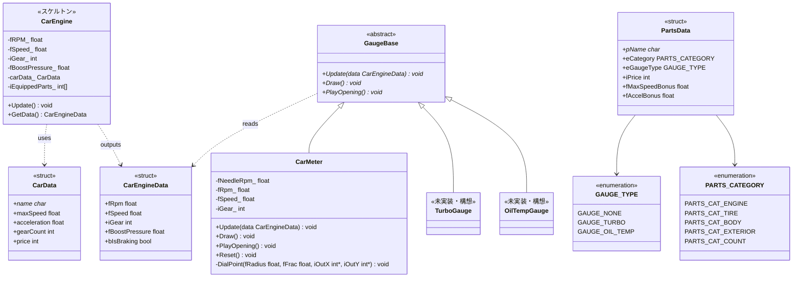

# エンジン・メーター・データ層クラス図(実装リバース)

実装元: `source/car_engine/`、`source/car_meter/`、`source/car_data.h`、`source/parts_data.h`。

実装状況メモ:

- `CarEngine` はスケルトン。`Update()` は中身が空で、引数の入力クラス(構想上の `GameKeyInput`)はコメントアウト中。`GetData()` はメンバをそのまま詰めて返すのみ
- `GaugeBase` は純粋仮想3メソッドの抽象基底として実装済み
- `CarMeter` は `GaugeBase` を継承する**表示専用クラス**として実装済み(`car_meter.h`/`car_meter.cpp` に集約)。`Update(CarEngineData)` で受け取った値を保持し針の表示値イージングだけ行い、`Draw()` でタコdial・針・デジタル表示を描画する。RPM/速度の物理計算はクラス内に持たない。`PlayOpening()` は現状スタブ。旧2重定義(`carMeter.cpp`)と空ファイル(`car_meter.cpp` 旧・`a.cpp`)は削除済み
- デバッグメーター画面(F2)は `debug.cpp` の static `CarMeter s_meter` を使って描画する。スロットル→RPM→速度の簡易計算は同画面が手続き型で持ち、`CarEngineData` に詰めて `s_meter.Update()` に渡す
- `TurboGauge` / `OilTempGauge` は未実装(構想のみ)

マスターデータ(グローバル定数):

- `CAR_TABLE[]` / `CAR_TABLE_COUNT` — 車両マスタ(`car_data.cpp`)
- `PARTS_TABLE[]` / `PARTS_TABLE_COUNT` — パーツマスタ(`parts_data.cpp`)
