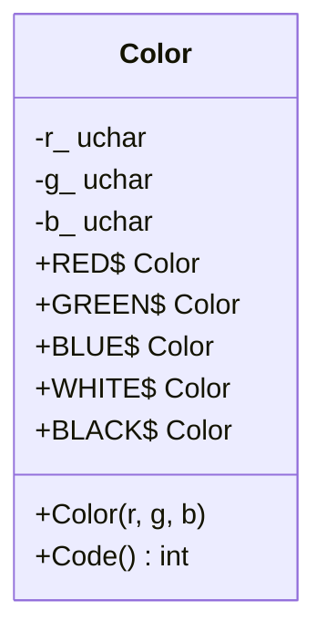

```mermaid
classDiagram
    class Color {
        -r_ uchar
        -g_ uchar
        -b_ uchar
        +Color(r, g, b)
        +Code() int
        +RED$ Color
        +GREEN$ Color
        +BLUE$ Color
        +WHITE$ Color
        +BLACK$ Color
    }
```