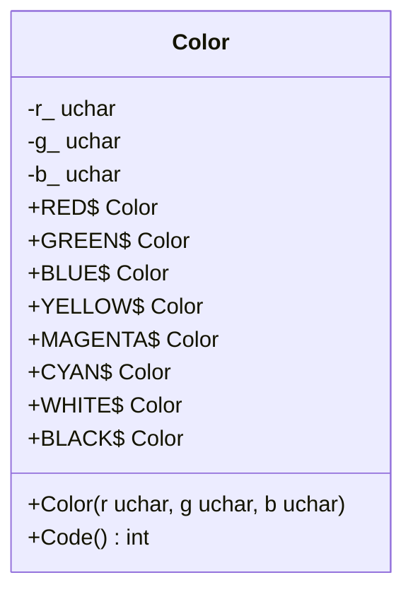

# Colorクラス図(実装リバース)

実装元: `source/share.h(.cpp)`。DxLib の `GetColor` を隠蔽する値オブジェクト。描画系には `Code()` が返すカラーコードのみを渡す。

```mermaid
classDiagram
    class Color {
        -r_ uchar
        -g_ uchar
        -b_ uchar
        +Color(r uchar, g uchar, b uchar)
        +Code() int
        +RED$ Color
        +GREEN$ Color
        +BLUE$ Color
        +YELLOW$ Color
        +MAGENTA$ Color
        +CYAN$ Color
        +WHITE$ Color
        +BLACK$ Color
    }
```
