# 入力層クラス図(実装リバース)

実装元: `source/input/` 配下。抽象基底 `KeyInput` を各画面専用の派生クラスが継承する。

- 各画面の .cpp が static インスタンスを持ち、`UpdateXxxInput()` 経由でメインループから毎フレーム `Update()` が呼ばれる
- `DebugInput` / `DebugRawInput` / `DebugMeterInput` は `_DEBUG` ビルド限定
- `DebugMeterInput` はクラス定義・実装はあるが現状未使用(メーター画面は `DebugInput` を使用)
- UML構想上の `GameKeyInput`(ゲーム画面用)は未実装

```mermaid
classDiagram
    class KeyInput {
        <<abstract>>
        -cPrevKeyState_ char[256]
        -cCurrKeyState_ char[256]
        +Update()* void
        #RefreshKeyState() void
        #IsPressed(iKeyCode int) bool
        #IsTriggered(iKeyCode int) bool
    }

    class TitleInput {
        -bIsAnyInputPressed_ bool
        -bIsDebugMenuTriggered_ bool
        -bIsMeterTriggered_ bool
        +Update() void
        +IsAnyInputPressed() bool
        +IsDebugMenuTriggered() bool
        +IsMeterTriggered() bool
    }

    class GarageInput {
        -bIsMenuUpTriggered_ bool
        -bIsMenuDownTriggered_ bool
        -bIsCarPrevTriggered_ bool
        -bIsCarNextTriggered_ bool
        -bIsDecideTriggered_ bool
        +Update() void
        +IsMenuUpTriggered() bool
        +IsMenuDownTriggered() bool
        +IsCarPrevTriggered() bool
        +IsCarNextTriggered() bool
        +IsDecideTriggered() bool
    }

    class DealerInput {
        -bIsLeftTriggered_ bool
        -bIsRightTriggered_ bool
        -bIsDecideTriggered_ bool
        -bIsCancelTriggered_ bool
        +Update() void
        +IsLeftTriggered() bool
        +IsRightTriggered() bool
        +IsDecideTriggered() bool
        +IsCancelTriggered() bool
    }

    class CustomizeInput {
        -bIsUpTriggered_ bool
        -bIsDownTriggered_ bool
        -bIsLeftTriggered_ bool
        -bIsRightTriggered_ bool
        -bIsDecideTriggered_ bool
        -bIsCancelTriggered_ bool
        +Update() void
        +IsUpTriggered() bool
        +IsDownTriggered() bool
        +IsLeftTriggered() bool
        +IsRightTriggered() bool
        +IsDecideTriggered() bool
        +IsCancelTriggered() bool
    }

    class ResultInput {
        -bIsAnyInputPressed_ bool
        +Update() void
        +IsAnyInputPressed() bool
    }

    class DebugInput {
        <<_DEBUG限定>>
        -bIsAccel_ bool
        -bIsGearUpTriggered_ bool
        -bIsGearDownTriggered_ bool
        -bIsRetireTriggered_ bool
        -bIsResetTriggered_ bool
        -iCarSelectTriggered_ int
        +Update() void
        +IsAccel() bool
        +IsGearUpTriggered() bool
        +IsGearDownTriggered() bool
        +IsRetireTriggered() bool
        +IsResetTriggered() bool
        +GetCarSelectTriggered() int
    }

    class DebugRawInput {
        <<_DEBUG限定>>
        +Update() void
        +IsKeyPressed(iKeyCode int) bool
        +IsKeyTriggered(iKeyCode int) bool
    }

    class DebugMeterInput {
        <<_DEBUG限定・未使用>>
        -bIsAccel_ bool
        -bIsGearUpTriggered_ bool
        -bIsGearDownTriggered_ bool
        -bIsRetireTriggered_ bool
        -bIsResetTriggered_ bool
        -bCarSelect1Triggered_ bool
        -bCarSelect2Triggered_ bool
        -bCarSelect3Triggered_ bool
        -bCarSelect4Triggered_ bool
        -bCarSelect5Triggered_ bool
        +Update() void
        +IsAccel() bool
        +IsGearUpTriggered() bool
        +IsGearDownTriggered() bool
        +IsRetireTriggered() bool
        +IsResetTriggered() bool
        +IsCarSelect1Triggered() bool
        +IsCarSelect2Triggered() bool
        +IsCarSelect3Triggered() bool
        +IsCarSelect4Triggered() bool
        +IsCarSelect5Triggered() bool
    }

    class GameKeyInput {
        <<未実装・構想>>
        -isAccel_ bool
        -isGearUpTriggered_ bool
        -isGearDownTriggered_ bool
        -isRetireTriggered_ bool
        +Update() void
        +IsAccel() bool
        +IsGearUpTriggered() bool
        +IsGearDownTriggered() bool
        +IsRetireTriggered() bool
    }

    KeyInput <|-- TitleInput
    KeyInput <|-- GarageInput
    KeyInput <|-- DealerInput
    KeyInput <|-- CustomizeInput
    KeyInput <|-- ResultInput
    KeyInput <|-- DebugInput
    KeyInput <|-- DebugRawInput
    KeyInput <|-- DebugMeterInput
    KeyInput <|-- GameKeyInput
```

