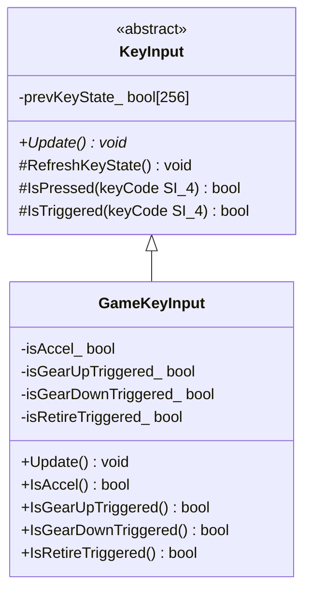

```mermaid
classDiagram
    %% ===== 入力層 =====
    class KeyInput {
        <<abstract>>
        -prevKeyState_ bool[256]
        +Update()* void
        #RefreshKeyState() void
        #IsPressed(keyCode SI_4) bool
        #IsTriggered(keyCode SI_4) bool
    }

    class GameKeyInput {
        -isAccel_ bool
        -isGearUpTriggered_ bool
        -isGearDownTriggered_ bool
        -isRetireTriggered_ bool
        +Update() void
        +IsAccel() bool
        +IsGearUpTriggered() bool
        +IsGearDownTriggered() bool
        +IsRetireTriggered() bool
    }

    KeyInput <|-- GameKeyInput

```