# 全体クラス図(実装リバース)

現時点の実装(`source/` 配下)をリバースエンジニアリングした全体図。層別の詳細は以下を参照:

- 入力層の詳細 → `class_KeyInput.md`
- リソース層の詳細 → `class_resourceManager.md`
- Color の詳細 → `class_Color.md`
- エンジン/メーター/データ層の詳細 → `class.md`
- 画面遷移 → `state_screen.md`、フレーム処理の流れ → `sequence.md`

注記:

- 画面(タイトル・ガレージ等)はクラスではなく「UpdateInput / Update / Draw の関数3点セット + static 変数」の手続き型モジュールで実装されている。ここでは画面管理の構造体のみ図示する
- `<<スケルトン>>` = 定義のみで処理未実装、`<<未実装・構想>>` = ソース上に存在しない

```mermaid
classDiagram
    %% ===== 画面管理層(screen_manager.h) =====
    class ScreenManager {
        <<struct>>
        +updateInput UpdateInputFunc
        +update UpdateFunc
        +draw DrawFunc
        +nextUpdateInput UpdateInputFunc
        +nextUpdate UpdateFunc
        +nextDraw DrawFunc
    }

    class SCREEN_FUNCTIONS {
        <<struct>>
        +updateInput UpdateInputFunc
        +update UpdateFunc
        +draw DrawFunc
    }

    class SCREEN_NAME {
        <<enumeration>>
        SCREEN_OPENING
        SCREEN_TITLE
        SCREEN_GARAGE
        SCREEN_DEALER
        SCREEN_CUSTOMIZE
        SCREEN_GAME
        SCREEN_RESULT
        SCREEN_DEBUG_MENU(_DEBUG)
        SCREEN_DEBUG_DRAW(_DEBUG)
        SCREEN_DEBUG_INPUT(_DEBUG)
        SCREEN_DEBUG_METER(_DEBUG)
        SCREEN_COUNT
    }

    ScreenManager ..> SCREEN_FUNCTIONS : g_ScreenFuncs[SCREEN_COUNT]から設定
    SCREEN_FUNCTIONS ..> SCREEN_NAME : 添字

    %% ===== 入力層(source/input/ 詳細は class_KeyInput.md) =====
    class KeyInput {
        <<abstract>>
        -cPrevKeyState_ char[256]
        -cCurrKeyState_ char[256]
        +Update()* void
        #RefreshKeyState() void
        #IsPressed(iKeyCode int) bool
        #IsTriggered(iKeyCode int) bool
    }

    class TitleInput
    class GarageInput
    class DealerInput
    class CustomizeInput
    class ResultInput
    class DebugInput {
        <<_DEBUG限定>>
    }
    class DebugRawInput {
        <<_DEBUG限定>>
    }
    class DebugMeterInput {
        <<_DEBUG限定・未使用>>
    }
    class GameKeyInput {
        <<未実装・構想>>
    }

    KeyInput <|-- TitleInput
    KeyInput <|-- GarageInput
    KeyInput <|-- DealerInput
    KeyInput <|-- CustomizeInput
    KeyInput <|-- ResultInput
    KeyInput <|-- DebugInput
    KeyInput <|-- DebugRawInput
    KeyInput <|-- DebugMeterInput
    KeyInput <|-- GameKeyInput

    %% ===== エンジン層(source/car_engine/) =====
    class CarEngineData {
        <<struct>>
        +fRpm float
        +fSpeed float
        +iGear int
        +fBoostPressure float
        +bIsBraking bool
    }

    class CarEngine {
        <<スケルトン>>
        -fRPM_ float
        -fSpeed_ float
        -iGear_ int
        -fBoostPressure_ float
        -carData_ CarData
        -iEquippedParts_ int[]
        +Update() void
        +GetData() CarEngineData
    }

    CarEngine ..> CarData : uses
    CarEngine ..> CarEngineData : outputs

    %% ===== メーター層(source/car_meter/) =====
    class GaugeBase {
        <<abstract>>
        +Update(data CarEngineData)* void
        +Draw()* void
        +PlayOpening()* void
    }

    class CarMeter {
        <<スケルトン・2重定義あり>>
    }

    GaugeBase <|-- CarMeter
    GaugeBase ..> CarEngineData : reads

    %% ===== データ層 =====
    class CarData {
        <<struct>>
        +name char*
        +maxSpeed float
        +acceleration float
        +gearCount int
        +price int
    }

    class PartsData {
        <<struct>>
        +pName char*
        +eCategory PARTS_CATEGORY
        +eGaugeType GAUGE_TYPE
        +iPrice int
        +fMaxSpeedBonus float
        +fAccelBonus float
    }

    class PARTS_CATEGORY {
        <<enumeration>>
        PARTS_CAT_ENGINE
        PARTS_CAT_TIRE
        PARTS_CAT_BODY
        PARTS_CAT_EXTERIOR
        PARTS_CAT_COUNT
    }

    class GAUGE_TYPE {
        <<enumeration>>
        GAUGE_NONE
        GAUGE_TURBO
        GAUGE_OIL_TEMP
    }

    PartsData --> PARTS_CATEGORY
    PartsData --> GAUGE_TYPE

    %% ===== ゲーム進行データ(game_data.h、グローバル g_gameData) =====
    class PlayerCar {
        <<struct>>
        +name char[64]
        +hSprite int
        +maxSpeed float
        +acceleration float
        +gearCount int
        +price int
        +equippedParts int[PARTS_CAT_COUNT]
    }

    class GameData {
        <<struct>>
        +money int
        +carCount int
        +selectedCarIndex int
        +cars PlayerCar[8]
        +lastTime float
        +lastRank int
        +bestTime float
    }

    GameData *-- PlayerCar : MAX_GARAGE_CARS=8
    PlayerCar ..> PARTS_CATEGORY : 装備スロット添字

    %% ===== リソース層(詳細は class_resourceManager.md) =====
    class RESOURCE_ITEM {
        <<struct>>
        +pHandle int*
        +pFilePath char*
    }

    class ResourceManager {
        <<abstract>>
        +LoadResources() void
        +UnloadResources() void
        #GetResources()* RESOURCE_ITEM*
    }

    class TitleResource {
        -resources RESOURCE_ITEM[4]
        #GetResources() RESOURCE_ITEM*
    }

    ResourceManager <|-- TitleResource
    TitleResource *-- RESOURCE_ITEM

    %% ===== ユーティリティ(share.h) =====
    class Color {
        -r_ uchar
        -g_ uchar
        -b_ uchar
        +Color(r uchar, g uchar, b uchar)
        +Code() int
        +RED$ Color
        +GREEN$ Color
        +BLUE$ Color
        +YELLOW$ Color
        +MAGENTA$ Color
        +CYAN$ Color
        +WHITE$ Color
        +BLACK$ Color
    }
```

主なグローバル変数:

| 変数 | 型 | 定義元 | 用途 |
|---|---|---|---|
| `g_screen` | `ScreenManager` | screen_manager.cpp | 現在画面の関数ポインタと次画面の予約 |
| `g_ScreenFuncs[SCREEN_COUNT]` | `SCREEN_FUNCTIONS[]` | screen_manager.cpp | 画面ID→関数3点セットのテーブル |
| `g_gameData` | `GameData` | game_data.cpp | 画面間で共有するゲーム進行データ |
| `g_hBg` / `g_hShutter` / `g_hLogo` | `int` | title_resource.cpp | タイトル系画像ハンドル |
| `CAR_TABLE[]` / `PARTS_TABLE[]` | `const CarData[]` / `const PartsData[]` | car_data.cpp / parts_data.cpp | マスターデータ |
