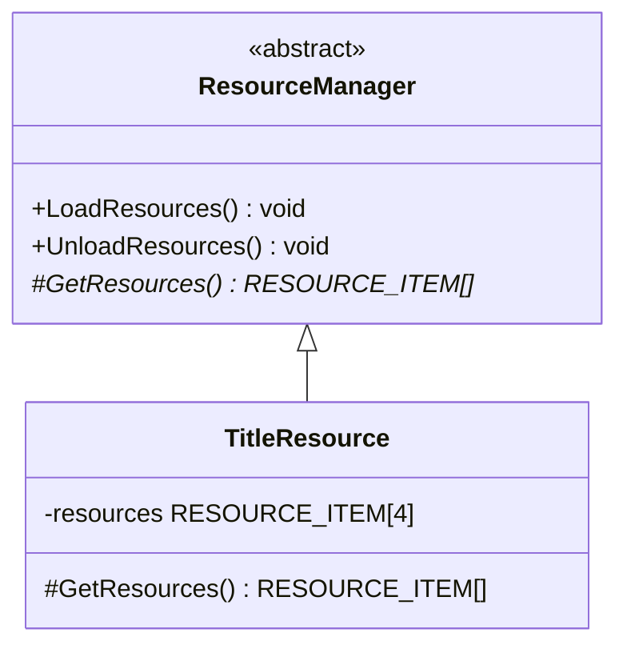

```mermaid
classDiagram
    %% ===== リソース層 =====
    class ResourceManager {
        <<abstract>>
        +LoadResources() void
        +UnloadResources() void
        #GetResources()* RESOURCE_ITEM[]
    }

    class TitleResource {
        -resources RESOURCE_ITEM[4]
        #GetResources() RESOURCE_ITEM[]
    }

    ResourceManager <|-- TitleResource
```