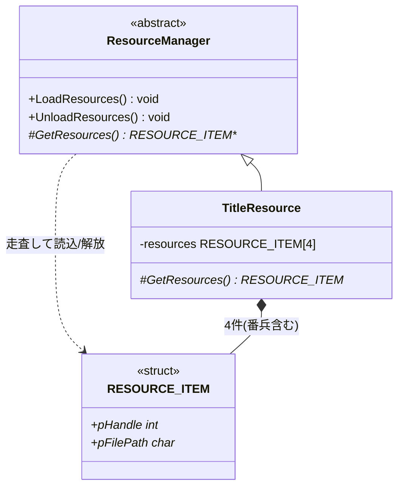

# リソース層クラス図(実装リバース)

実装元: `source/manager/resourceManager.h(.cpp)`、`source/title_resource.h(.cpp)`。

- 派生クラスは `GetResources()` で `{画像ハンドルポインタ, ファイルパス}` の配列を返す(末尾は番兵 `{nullptr, nullptr}`)
- `LoadResources()` / `UnloadResources()` が配列を走査して読み込み・解放を共通処理する
- `TitleResource` はグローバルの画像ハンドル `g_hBg` / `g_hShutter` / `g_hLogo` に読み込む

