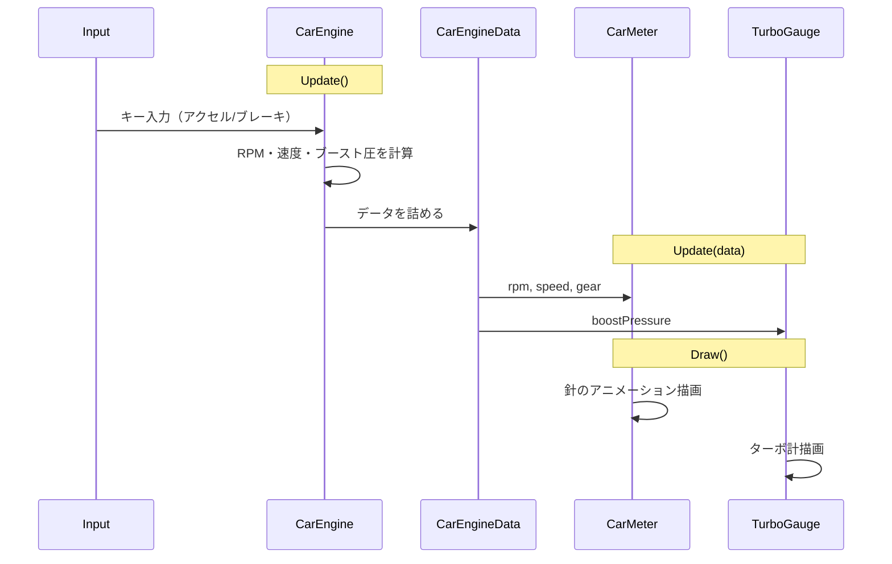

```mermaid
sequenceDiagram
    participant Input
    participant CarEngine
    participant CarEngineData
    participant CarMeter
    participant TurboGauge

    Note over CarEngine: Update()
    Input->>CarEngine: キー入力（アクセル/ブレーキ）
    CarEngine->>CarEngine: RPM・速度・ブースト圧を計算
    CarEngine->>CarEngineData: データを詰める

    Note over CarMeter,TurboGauge: Update(data)
    CarEngineData->>CarMeter: rpm, speed, gear
    CarEngineData->>TurboGauge: boostPressure

    Note over CarMeter,TurboGauge: Draw()
    CarMeter->>CarMeter: 針のアニメーション描画
    TurboGauge->>TurboGauge: ターボ計描画
```