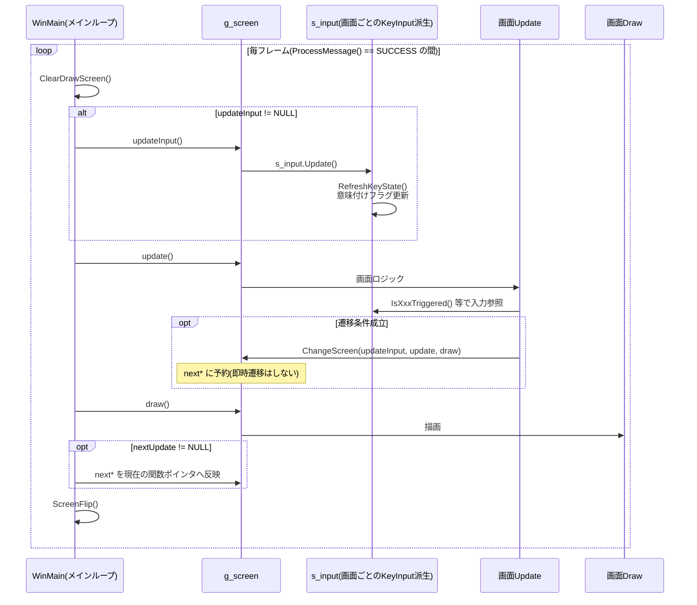
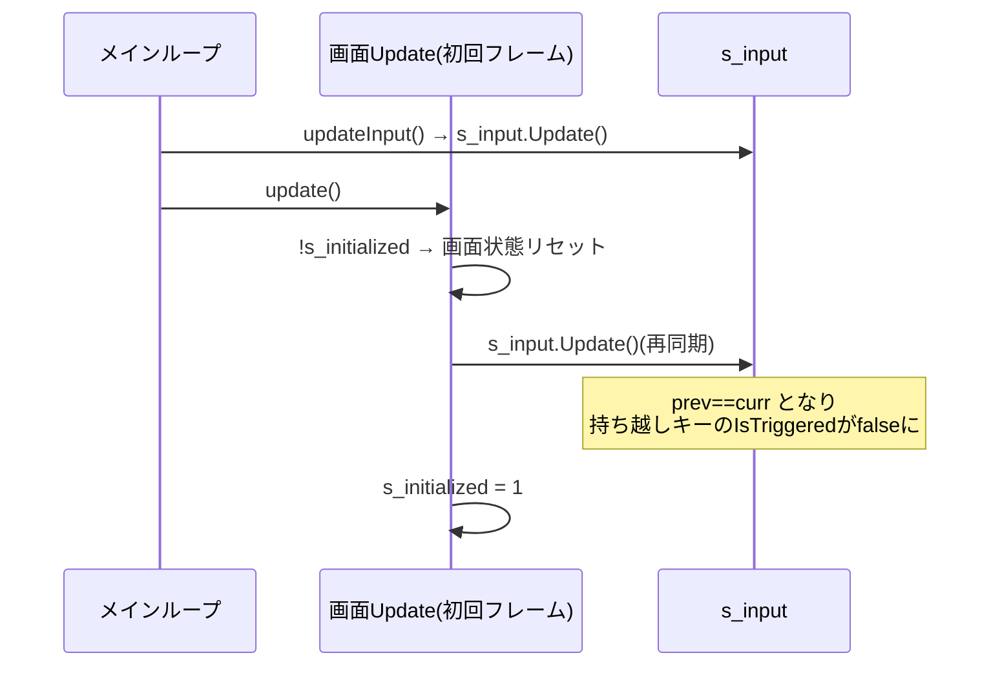
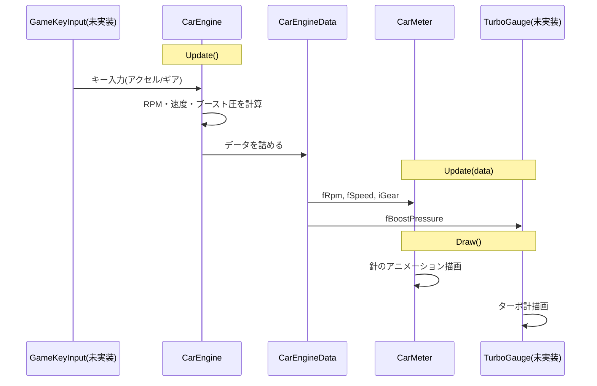

# シーケンス図(実装リバース)

## 1. メインループ(main.cpp — 実装済み)

1フレームの処理順。`updateInput` が NULL の画面(オープニング、ゲーム)は入力更新をスキップする。
画面遷移は `ChangeScreen()` で `next*` に予約され、フレーム末尾でまとめて反映される。

## 2. 画面突入時の入力再同期(実装済み・重要)

各画面の Update は初回フレームに init ブロックを持ち、そこで `s_input.Update()` をもう一度呼ぶ。
前画面から押しっぱなしのキーが新画面でトリガー誤発火するのを防ぐためで、削除してはならない。

## 3. エンジン→メーターのデータフロー(未実装・構想)

レースロジック(ゲーム画面)実装時の構想。現状は `CarEngine` / `CarMeter` ともスケルトンで、
針アニメーションのプロトタイプは `debug.cpp` のデバッグメーター画面に手続き型で存在する。

