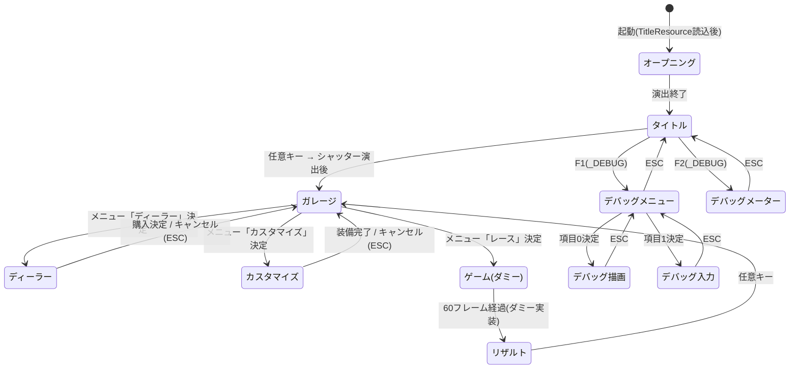

# 画面遷移図(実装リバース)

実装元: 各画面 .cpp の `ChangeScreen()` 呼び出し。デバッグ系画面は `_DEBUG` ビルド限定。

実装状況メモ:

- ゲーム画面はダミー実装: 入力なし(updateInput=NULL)で60フレーム待機後、ダミーのリザルトデータ(1位/12.34秒)を `g_gameData` に書いてリザルトへ遷移する
- ディーラー: 車両購入決定 or キャンセルでガレージへ戻る
- カスタマイズ: パーツ購入装備 or キャンセルでガレージへ戻る

